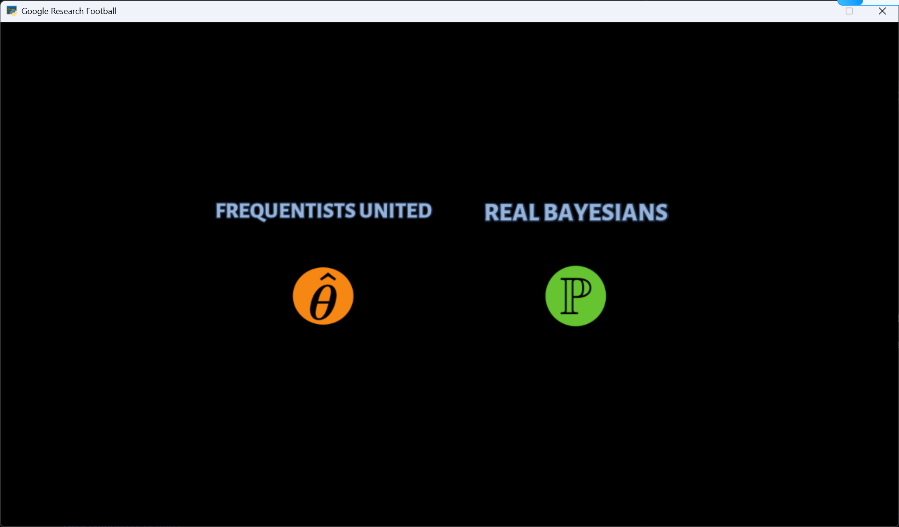
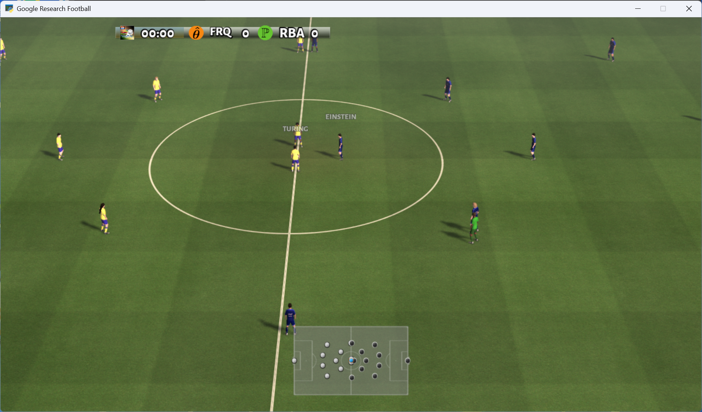
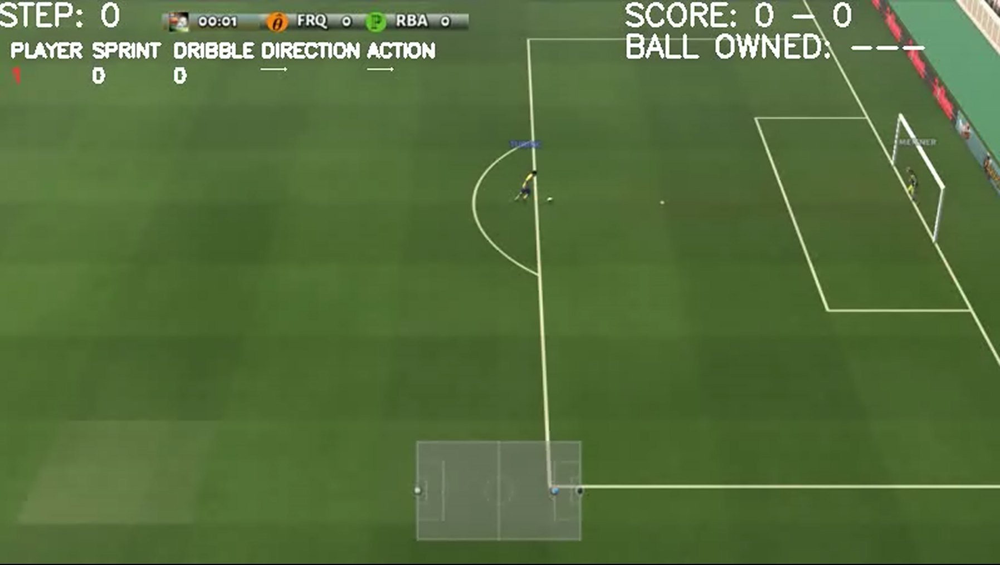
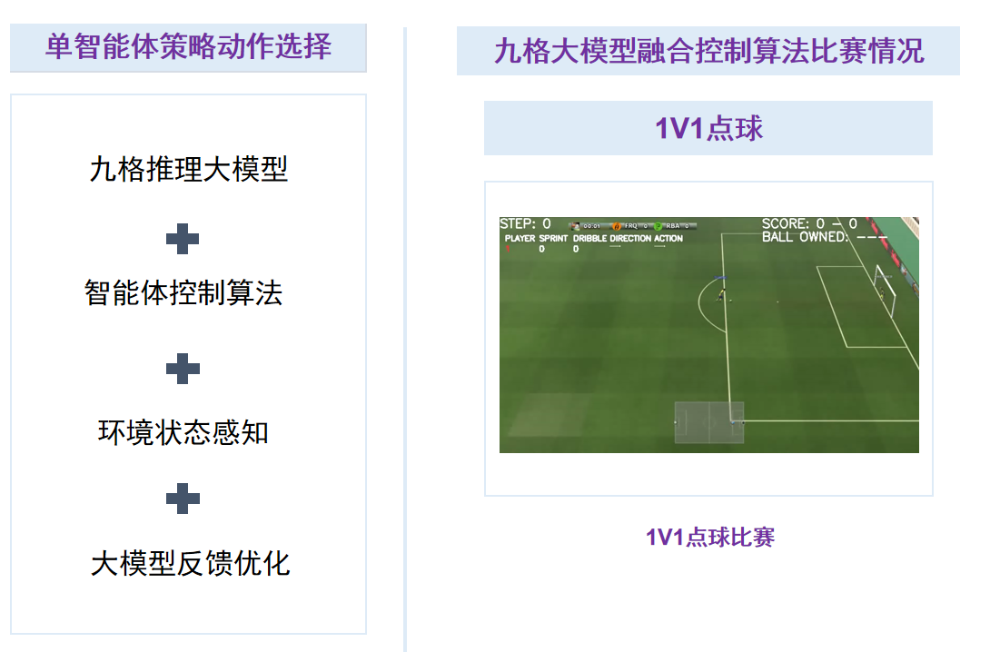

#  2025无人系统具身智能算法挑战赛---人形机器人点球赛使用手册


## 介绍

​		本手册专为" 2025无人系统具身智能算法挑战赛 "中的人形机器人点球赛参赛队伍设计，提供完整的大模型-人形机器人协同开发指导手册。手册围绕"视觉感知-决策控制-人形机器人执行"的技术闭环，帮助参赛者快速构建基于九格大模型的人形机器人点球控制系统。

​		本手册采用"理论→工具→实践"的递进式设计，助力参赛团队快速实现"语言指令→场景理解→动作执行"的智能人形机器人点球控制闭环，为大赛竞技提供坚实的技术支撑。

```
# 2025无人系统具身智能算法挑战赛 使用手册限制条款

© 2025 无人系统具身智能算法挑战赛组委会 版权所有

**使用授权范围：**  
本手册仅授权以下主体在赛事期间使用：

1. 经组委会认证的参赛团队队员
2. 赛事官方裁判及技术监督人员
3. 组委会授权的培训导师

**严格禁止事项：**  

-  任何形式的商业性使用或二次销售  
-  向非参赛组织或个人进行传播  
-  改编后用于其他赛事或商业项目  
-  在线平台/文库的公开传播  

**使用约束：**  
手册所含技术方案、赛事规则及数据参数等知识产权归组委会所有，参赛者仅限：

-  赛事筹备期用于技术方案设计参考
-  正式竞赛期间作为操作规范依据
-  赛后总结阶段用于技术复盘分析

**免责声明：**  
本手册内容按"现有状态"提供：
 组委会不承担因手册信息导致的技术方案偏差责任  
 不保证所含方案满足特定技术场景的实施需求  
 对使用后果不承担直接或间接法律责任  

*违反本条款者组委会有权取消参赛资格并追究法律责任*
```


## 目录

[TOC]


## （一） 九格4B大模型使用

本次大赛推荐使用的操作系统为ubuntu20.04、显卡显存22G及以上

#### 1.模型下载

​		官网下载：可在 https://thunlp-model.oss-cn-wulanchabu.aliyuncs.com/9G4B.tar 下载4B模型。

​		百度网盘：https://pan.baidu.com/s/1o8GMcEl_SYc2euaifVKstQ?pwd=8888       提取码: 8888 

​		阿里云网盘：https://www.alipan.com/s/be42mHqfrWX       提取码: 1zp2	

​		解压九格大模型：

```shell
tar -xvf 9G4B.tar
```

​		解压完成后9G4B的文件夹中文件详情如下：


#### 2.环境搭建

​		为保证环境可以顺利部署，推荐使用conda创建环境，使用python 3.10来保证环境一致性。

conda环境创建：

```python
conda create -n env_name python==3.10 # 环境创建，env_name可替换成自己的环境名称
conda activate env_name  #激活环境
```

安装Pytorch:

​		Pytorch安装需要与CUDA版本匹配，[Get Started](https://pytorch.org/get-started/locally/)进入pytorch官网查看相关命令

​		下图为windows系统下载示例：


​		安装命令（根据选手下载的版本寻找对应命令）：

```python
pip3 install torch torchvision torchaudio --index-url https://download.pytorch.org/whl/cu118
```

​		安装依赖:

​		为实现对九格的模型的调用，请运行下列命令，安装依赖。

```python
pip install transformers==4.44.0
pip install datamodel-code-generator
pip install accelerate
pip install jsonschema
pip install pytrie
pip install sentencepiece
pip install protobuf
```

​		安装VLLM依赖（可选）

​		使用VLLM可以加快模型推理速度，详情参照[九格大模型官网](https://www.osredm.com/jiuyuan/CPM-9G-8B/tree/master/README.md)。

#### 3.模型运行测试

Transformers原生代码推理脚本示例

```python
#此代码适用于4B模型单卡推理
import os
import torch
from transformers import AutoTokenizer, AutoModelForCausalLM
if __name__ == "__main__":
    model_path = "XXXX"  # 请替换为正确的模型路径
    prompt = "请介绍一下九格大模型。"
    tokenizer = AutoTokenizer.from_pretrained(model_path, trust_remote_code=True)
    device = torch.device("cuda" if torch.cuda.is_available() else "cpu")
    model = AutoModelForCausalLM.from_pretrained(
        model_path, 
        torch_dtype=torch.bfloat16, 
        trust_remote_code=True
    )
    model.to(device)
    model.eval()
    prompt = tokenizer.apply_chat_template(conversation=[{"role": "user", "content": prompt}], add_generation_prompt=True, tokenize=False)
    inputs = tokenizer(prompt, return_tensors="pt")
    inputs.to(model.device)
    with torch.no_grad():
        res = model.generate(**inputs, max_new_tokens=256)
    responses = tokenizer.decode(res[0][inputs.input_ids.shape[1]:], skip_special_tokens=True)
    ai_answer = responses.strip()
    print(ai_answer)
```

## （二） 谷歌足球仿真环境配置

#### 1.仿真环境代码下载

​		本次比赛使用的是谷歌足球仿真环境，请下载安装谷歌足球仿真环境包，下载地址如下：[比赛环境代码下载地址](通过网盘分享的文件：单智能体点球赛道资料
链接: https://pan.baidu.com/s/1LLNW--muHG8PG7dTG4a4Ew?pwd=4264 提取码: 4264 
--来自百度网盘超级会员v6的分享
)

#### 2.仿真环境配置

##### 2.1 准备

Linux

​		Ubuntu20.04版本

```
sudo apt-get install git cmake build-essential libgl1-mesa-dev libsdl2-dev \
libsdl2-image-dev libsdl2-ttf-dev libsdl2-gfx-dev libboost-all-dev \
libdirectfb-dev libst-dev mesa-utils xvfb x11vnc python3-pip

python3 -m pip install --upgrade pip setuptools psutil wheel
```

windows

```
python -m pip install --upgrade pip setuptools psutil wheel
```

##### 2.2 安装GFootball环境依赖

​		可直接使用pip直接下载：

```
python3 -m pip install gfootball
pip install six
```

​		如果出现网络错误替换为以下命令：

```
python3 -m pip install gfootball -i https://mirrors.aliyun.com/pypi/simple/ --trusted-host mirrors.aliyun.com

pip install six -i https://mirrors.aliyun.com/pypi/simple/ --trusted-host mirrors.aliyun.com
```

​		完成安装后，运行下面代码进行测试，文件位置位于/football/gfootball

```python
python3 -m gfootball.play_game --action_set=full
```

​		GFootball安装成功会出现如下图形显示界面：





## （三） 单智能体点球仿真相关接口

#### 1.基础代码框架

```python
from __future__ import absolute_import
from __future__ import division
from __future__ import print_function

from absl import app
from absl import flags
from absl import logging

from gfootball.env import config
from gfootball.env import football_env
import torch
from transformers import AutoTokenizer, AutoModelForCausalLM
"""
FLAGS设置环境信息
"""
FLAGS = flags.FLAGS
flags.DEFINE_string('players', 'keyboard:left_players=1', 'Players')
flags.DEFINE_string('level', 'academy_empty_goal', 'Level to play')
flags.DEFINE_enum('action_set', 'full', ['default', 'full'], 'Action set')
flags.DEFINE_bool('real_time', False, 'Real time mode')
flags.DEFINE_bool('render', True, 'Whether to do game rendering.')

"""
动作列表
"""
action_list = [
    "idle", "left", "top_left", "top", "top_right", "right", "bottom_right",
    "bottom", "bottom_left", "long_pass", "high_pass", "short_pass", "shot",
    "sprint", "release_direction", "release_sprint", "sliding", "dribble", "release_dribble"
] 

"""
动作选择以及模型导入，选手应当自己完成，对代码函数名称和格式不做具体要求，但需要注释代码的功能和保存动作输出的日志。
"""
def initialize_model(model_path):
    """
    初始化九格大模型和分词器
    加载模型
    """

"""
获取动作部分
"""
def get_action(state):
    """算法或是规则|或通过大模型选择动作"""
    return action

""" 
main函数
"""

def main(_):
    """ 单智能体点球场景设置 """
    players = FLAGS.players.split(';') if FLAGS.players else ''
    
    cfg_values = {
        'action_set': FLAGS.action_set,
        'dump_full_episodes': True,
        'players': players,
        'real_time': FLAGS.real_time,
        'level': FLAGS.level,
        'render': FLAGS.render
    }
    
    cfg = config.Config(cfg_values)
    env = football_env.FootballEnv(cfg)

    #是否开启实时显示
    if FLAGS.render:
        env.render()
    
    state = env.reset()
    #奖励值记录
    episode_count = 0
    total_reward = 0
    goals_scored = 0
    
    try:
        while episode_count < 7:
            re=0
            #模型进行动作选择，此函数为选手编写函数
            action = ai.get_action(state)
            
            next_state, reward, done, info = env.step(action)
            re += reward
            total_reward += reward
            
            if reward > 0:
                goals_scored += 1
                print(f"进球了！！！ 奖励: {reward}")
            state = next_state
            
            
            if done:
                
                episode_count += 1
                print(f"\n第 {episode_count} 回合结束")
                print(f" 总奖励: {total_reward}")
                print(f" 总进球数: {goals_scored}")
                print(f" 视频已保存")
                print("=" * 50)
                
                state = env.reset()
        print("\n总结：")
        print("\n\n 比赛回顾")
        print(f"七轮总得分: {total_reward}")
        print(f"七轮总进球数: {goals_scored}")              
    except KeyboardInterrupt:
        print('\n游戏结束，保存视频...')
        env.write_dump('game_end')
        print(f"最终视频和数据已保存")
        print(f"总进球数: {goals_scored}")
        exit(1)
```

#### 2.接口介绍

##### 2.1 动作列表

​		动作列表中有19个动作，九格大模型根据环境状态信息在每个step选择一个动作，进而控制球员运动。

```python
action_list = [
    "idle", "left", "top_left", "top", "top_right", "right", "bottom_right",
    "bottom", "bottom_left", "long_pass", "high_pass", "short_pass", "shot",
    "sprint", "release_direction", "release_sprint", "sliding", "dribble",      "release_dribble"
]  
```

##### 2.2 环境信息获取接口

​		可通过下列代码获取环境状态、奖励值等信息，获取的环境状态信息包含动作执行后的环境状态next_state，动作奖励reward，完成信号done。

```python
next_state, reward, done, info = env.step(action)
state = next_state
```

##### 2.3 环境配置接口

​		通过cfg将环境场景设置传入到FootballEnv中，完成场景设置。

```python
   cfg_values = {
        'action_set': FLAGS.action_set,
        'dump_full_episodes': True,
        'players': players,
        'real_time': FLAGS.real_time,
        'level': FLAGS.level,
        'render': FLAGS.render
    }
    
    cfg = config.Config(cfg_values)
    env = football_env.FootballEnv(cfg)
```

##### 2.4 动作获取接口

​		参赛选手应实现一个get_action函数，该函数可以接受state，并返回动作。函数可在执行文件中实现，也可在外部文件中实现后引入执行文件。

```python
action = get_action(state)
```

##### 2.5 实时渲染接口

​		如有需要，可通过下面代码实现实时渲染。

```python
if FLAGS.render:
    env.render()
```

​		点球场景实时渲染结果：



##### 2.6 视频保存接口

​		在环境配置中增加下面配置就可保存视频到指定路径中。

​		**注意**：使用保存视频接口时需开启实时渲染代码。

```python
    cfg_values = {
        'write_video': True,  # 开启视频录制
        'video_format': 'avi',  # 视频格式
        'video_quality_level': 0,  # 视频质量
        'tracesdir': ''#视频保存路径    
    }
```

## （四） 整体技术框架

#### 1.整体技术框架

比赛可使用如下两种方式选择动作：

方式1：策略算法+大模型提示词。

方式2：策略算法+大模型微调。

无论哪种方式，其基础框架都是接受基本的环境状态，奖励等信息，返回一个合法的动作来更新环境信息，并获得进球得分。



#### 2.策略优化算法

选手可选用或改进传统强化学习算法（或其他可提高进球率的算法，如BC模仿算法），对于是否使用强化学习算法，比赛不做强制要求。

#### 3.大模型微调

若要进行大模型微调，则选手应当自己采集制作数据集。使用的微调框架不限，微调模型应为9G4B。

若选手对九格4B大模型进行了微调，则除源代码外，选手还应当向赛方提供微调后的模型以及整体的微调策略说明。


