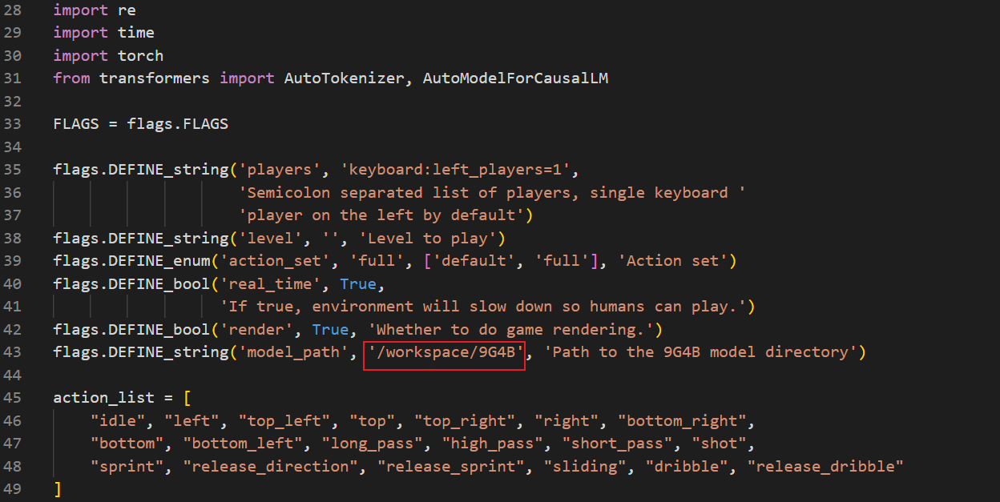
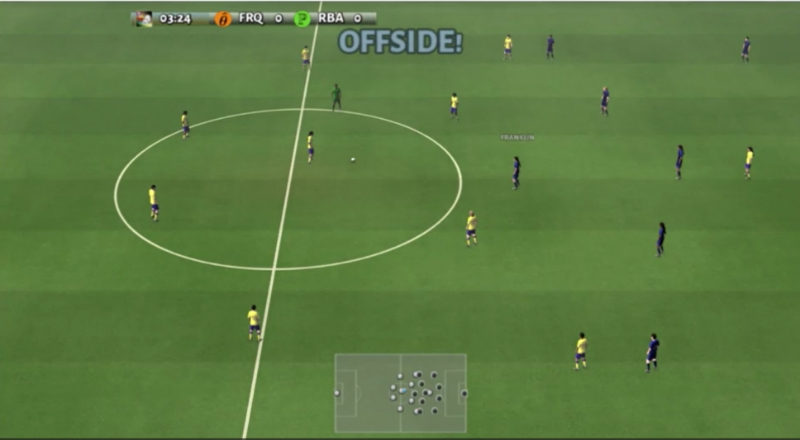
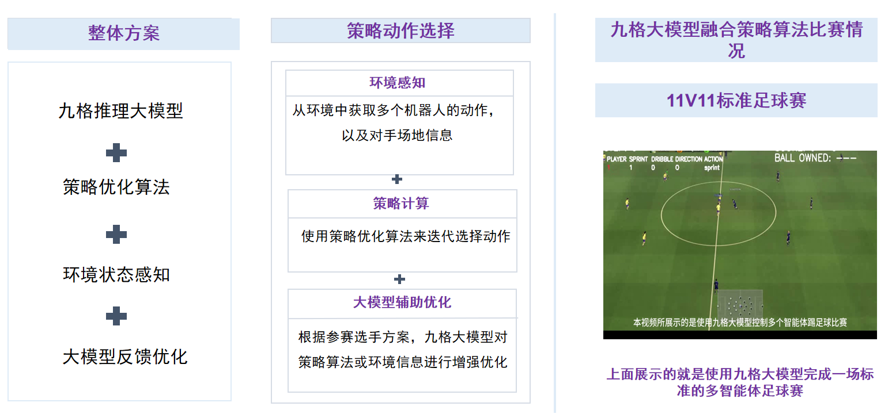

# 2025无人系统具身智能算法挑战赛---多智能体人形机器人足球赛使用手册


## 介绍

​		本手册专为" 2025无人系统具身智能算法挑战赛 "中的多智能体人形机器人足球赛参赛队伍设计，提供完整的大模型-人形机器人协同开发指导手册。手册围绕"视觉感知-决策控制-人形机器人执行"的技术闭环，帮助参赛者快速构建基于九格大模型的多智能体人形机器人足球控制系统。

​		本手册采用"理论→工具→实践"的递进式设计，助力参赛团队快速实现"语言指令→场景理解→动作执行"的多智能体人形机器人足球赛控制闭环，为大赛竞技提供坚实的技术支撑。

```
# 2025无人系统具身智能算法挑战赛 使用手册限制条款

© 2025 无人系统具身智能算法挑战赛组委会 版权所有

**使用授权范围：**  
本手册仅授权以下主体在赛事期间使用：

1. 经组委会认证的参赛团队队员
2. 赛事官方裁判及技术监督人员
3. 组委会授权的培训导师

**严格禁止事项：**  

-  任何形式的商业性使用或二次销售  
-  向非参赛组织或个人进行传播  
-  改编后用于其他赛事或商业项目  
-  在线平台/文库的公开传播  

**使用约束：**  
手册所含技术方案、赛事规则及数据参数等知识产权归组委会所有，参赛者仅限：

-  赛事筹备期用于技术方案设计参考
-  正式竞赛期间作为操作规范依据
-  赛后总结阶段用于技术复盘分析

**免责声明：**  
本手册内容按"现有状态"提供：
 组委会不承担因手册信息导致的技术方案偏差责任  
 不保证所含方案满足特定技术场景的实施需求  
 对使用后果不承担直接或间接法律责任  

*违反本条款者组委会有权取消参赛资格并追究法律责任*
```


## 目录

[TOC]


## （一）九格4B大模型使用

​		**本次大赛推荐使用的操作系统为ubuntu20.04、显卡显存22G及以上**

#### 1.模型下载

​		官网下载：可在 https://thunlp-model.oss-cn-wulanchabu.aliyuncs.com/9G4B.tar 下载4B模型。

​		百度网盘：https://pan.baidu.com/s/1o8GMcEl_SYc2euaifVKstQ?pwd=8888       提取码: 8888 

​		阿里云网盘：https://www.alipan.com/s/be42mHqfrWX       提取码: 1zp2

​		解压九格大模型：

```shell
tar -xvf 9G4B.tar
```

​		解压完成后会得到一个9G4B的文件夹，目录如下：


​		为保证环境可以顺利部署，推荐使用conda创建环境，并建议使用python 3.10来保证环境一致性，环境创建代码如下

```python
conda create -n GRF python==3.10 # GRF可改成自己的环境名
conda activate GRF
```

​		为实现对九格大模型的调用，请运行下列命令，下载对应库

```python
pip install transformers==4.44.0
pip install datamodel-code-generator
pip install accelerate
pip install jsonschema
pip install pytrie
pip install sentencepiece
pip install protobuf
```

​		此外，推荐使用下面代码查看自己的cuda版本号，并前往[pytorch官网](https://pytorch.org/)下载对应pytorch，如想使用VLLM加快模型推理速度或进行其他操作，请访问[九格大模型官网](https://www.osredm.com/jiuyuan/CPM-9G-8B/tree/master/README.md)，并按对应指令操作

#### 2.模型使用测试

​		transformers原生代码推理脚本示例

​		此代码适用于4B模型单卡推理。在指定路径时，需指定pytorch_model.bin文件**所在目录**的路径，注意不是pytorch_model.bin文件本身的路径。

```python
import os
import torch
from transformers import AutoTokenizer, AutoModelForCausalLM
if __name__ == "__main__":
    model_path = "XXXX"  # 请替换为你的pytorch_model.bin文件所在的目录的路径
    prompt = "山东最高的山是？"
    tokenizer = AutoTokenizer.from_pretrained(model_path, trust_remote_code=True)
    device = torch.device("cuda" if torch.cuda.is_available() else "cpu")
    model = AutoModelForCausalLM.from_pretrained(
        model_path, 
        torch_dtype=torch.bfloat16, 
        trust_remote_code=True
    )
    model.to(device)
    model.eval()
    prompt = tokenizer.apply_chat_template(conversation=[{"role": "user", "content": prompt}], add_generation_prompt=True, tokenize=False)
    inputs = tokenizer(prompt, return_tensors="pt")
    inputs.to(model.device)
    with torch.no_grad():
        res = model.generate(**inputs, max_new_tokens=256)
    responses = tokenizer.decode(res[0][inputs.input_ids.shape[1]:], skip_special_tokens=True)
    ai_answer = responses.strip()
    print(ai_answer)
```

## （二）谷歌足球仿真环境配置

#### 1.仿真环境代码下载

​		比赛仿真环境代码存放在football目录下，其下载地址与九格大模型4B历史版本相同。

​		注意，源码下载可在谷歌足球环境库下载前（即仿真环境配置前），也可在下载后（即仿真环境配置后）。

#### 2.仿真环境配置

##### 2.1 准备

Linux

​		Ubuntu20.04版本

```
sudo apt-get install git cmake build-essential libgl1-mesa-dev libsdl2-dev \
libsdl2-image-dev libsdl2-ttf-dev libsdl2-gfx-dev libboost-all-dev \
libdirectfb-dev libst-dev mesa-utils xvfb x11vnc python3-pip

python3 -m pip install --upgrade pip setuptools psutil wheel
```

windows

```
python -m pip install --upgrade pip setuptools psutil wheel
```

##### 2.2 安装GFootball

​		可直接使用pip直接下载

```
python3 -m pip install gfootball
pip install six
```

​		如果下载速度过慢，也可使用以下命令加速下载

```
python3 -m pip install gfootball -i https://mirrors.aliyun.com/pypi/simple/ --trusted-host mirrors.aliyun.com

pip install six -i https://mirrors.aliyun.com/pypi/simple/ --trusted-host mirrors.aliyun.com
```

​		完成环境安装后，可运行以下测试代码

```python
python3 -m gfootball.play_game --action_set=full
# 若是上面代码运行后无任何结果且不报错，可尝试运行下面代码
python -m gfootball.play_game --action_set=full
```

​		若环境安装成功，则会出现以下界面：


**可能遇到的问题：**

```shell
ImportError: /home/ys/anaconda3/envs/GRF_J/bin/../lib/libstdc++.so.6: version GLIBCXX_3.4.30' not found (required by /home/ys/anaconda3/envs/GRF_J/lib/python3.10/site-packages/gfootball_engine/_gameplayfootball.so)
```

​		如果出现无法找到GLIBCXX相关的库的情况，使用以下命令找到包含GLIBCXX_3.4.30的库：

```shell
终端输入：strings /usr/lib/x86_64-linux-gnu/libstdc++.so.6 | grep GLIBCXX
```

​		确保系统文件中存在需要的GLIBCXX版本

解决方法：

```shell
终端处解决方法：export LD_LIBRARY_PATH=/usr/lib/x86_64-linux-gnu:$LD_LIBRARY_PATH
软连接方法：ln -s /usr/lib/x86_64-linux-gnu/libstdc++.so.6 $CONDA_PREFIX/lib/libstdc++.so.6(注意该操作可能会导致整个系统的链接发生一定变化)
```

#### 3.基础demo源码下载

​		在比赛环境代码的`football`目录下，我们提供了两个基础源码文件：

​		**LLM_Test.py**：仅调用大模型生成动作；

​		**LLM_Local.py**：通过规则与大模型结合实现动作生成。

​		请注意，**这两个文件均为Demo**，仅用于验证大模型的运行功能。

#### 4.仿真运行

​		请在运行代码前，将文件中的模型路径配置项（原红框标记处）替换为您本地的实际模型路径。



​		使用下列代码，可测试大模型在仿真环境下是否成功运行

```shell
# 运行前记得激活环境
conda activate GRF

python LLM_Local.py # 运行大模型+规则动作生成文件
python LLM_Test.py # 运行大模型动作生成文件
```

​		运行成功则会出现比赛界面及模型生成动作时间

## （三）谷歌足球仿真相关接口

#### 1.运行环境基础框架

​		（其中main函数部分，除视频保存|实时渲染是否开启功能可以修改，其余环境配置部分严禁修改）

```python
from __future__ import absolute_import
from __future__ import division
from __future__ import print_function

from absl import app
from absl import flags
from absl import logging

from gfootball.env import config
from gfootball.env import football_env
import torch
from transformers import AutoTokenizer, AutoModelForCausalLM
FLAGS = flags.FLAGS
flags.DEFINE_string('players', 'keyboard:left_players=1',
                    'Semicolon separated list of players, single keyboard '
                    'player on the left by default')
flags.DEFINE_string('level', '', 'Level to play')
flags.DEFINE_enum('action_set', 'full', ['default', 'full'], 'Action set')
flags.DEFINE_bool('real_time', True,
                  'If true, environment will slow down so humans can play.')
flags.DEFINE_bool('render', True, 'Whether to do game rendering.')


action_list = [
    "idle", "left", "top_left", "top", "top_right", "right", "bottom_right",
    "bottom", "bottom_left", "long_pass", "high_pass", "short_pass", "shot",
    "sprint", "release_direction", "release_sprint", "sliding", "dribble", "release_dribble"
] # 动作列表


"""
动作选择以及模型导入，选手应当自己完成
"""
def initialize_model(model_path):
    """
    初始化九格大模型和分词器
    加载模型
    """

"""生成动作部分"""
def get_action(state, reward):
    """算法或是规则|或通过大模型选择动作"""
    return action


# main函数部分，除视频保存|实时渲染是否开启功能可以修改，其余环境配置部分严禁修改
def main(_):
    episode_count = 0
    goals_scored = 0
    reward = 0
    players = FLAGS.players.split(';') if FLAGS.players else ''
    assert not (any(['agent' in player for player in players])
               ), ('Player type \'agent\' can not be used with play_game.')
    cfg_values = {
        'action_set': FLAGS.action_set,
        'dump_full_episodes': True,
        'players': players,
        'real_time': FLAGS.real_time,
        'level':'11_vs_11_easy_stochastic',
    }
    if FLAGS.level:
        cfg_values['level'] = FLAGS.level
    cfg = config.Config(cfg_values)
    env = football_env.FootballEnv(cfg)
    # 实时渲染开启，则取消注释
    # if FLAGS.render:
    #     env.render()
    state = env.reset()

    try:
        while episode_count < 1:
            action = get_action(state, reward)
            next_state, reward, done, info = env.step(action)
            if reward > 0:
                goals_scored += 1
            state = next_state
                
            if done:
                state = env.reset()
                episode_count += 1
            	print(f" 总进球数: {goals_scored}")
    except KeyboardInterrupt:
        logging.warning('Game stopped, writing dump...')
        env.write_dump('shutdown')
        exit(1)

if __name__ == '__main__':
    app.run(main)
```

#### 2.动作列表

​		动作列表中有19个动作，九格大模型需要在每个step选出一个动作让球员执行,球员将会由环境自动选定，九格大模型只需考虑在选取球员情况下，做出的最佳动作

```python
action_list = [
    "idle", "left", "top_left", "top", "top_right", "right", "bottom_right",
    "bottom", "bottom_left", "long_pass", "high_pass", "short_pass", "shot",
    "sprint", "release_direction", "release_sprint", "sliding", "dribble", "release_dribble"
]  
```

#### 3.环境信息获取接口

​		谷歌足球环境可通过下列代码输入动作，更新环境，并进一步获取环境信息，获取的环境信息有刷新后的环境状态next_state，动作奖励reward，一个episode是否完成的截止标志done，以及其他的额外信息info。state中的内容有球员编码，持球状态，球员状态，红黄牌情况等信息，是大模型选择动作的重要根据。

```python
next_state, reward, done, info = env.step(action)
state = next_state
```

#### 4.环境配置部分

​		下面是环境配置参数，该部分已有内容严禁进行更改

```python
    cfg_values = {
        'action_set': FLAGS.action_set,
        'dump_full_episodes': True,
        'players': players,
        'real_time': FLAGS.real_time,
        'level':'11_vs_11_easy_stochastic',
    }
    if FLAGS.level:
        cfg_values['level'] = FLAGS.level
    cfg = config.Config(cfg_values)
    env = football_env.FootballEnv(cfg)
```

#### 5.动作获取接口

​		参赛选手应实现一个get_action函数，该函数可以接受state,reward，并返回动作，函数可在执行文件中实现，也可在外部文件中实现后引入执行文件。

```python
action = get_action(state,reward)
```

#### 6.实时渲染接口

​		如有需要，可通过下面代码实现实时渲染。

```python
    if FLAGS.render:
        env.render()
```

#### 7.视频保存接口

​		若要保存视频，应增加下列代码并开启实时渲染。

```python
    cfg_values = {
        'action_set': FLAGS.action_set,
        'dump_full_episodes': True,
        'players': players,
        'real_time': FLAGS.real_time,
        'level':'11_vs_11_easy_stochastic',
        'write_video': True, #增加本行代码，就可以保存对局文件
    }
```

​		保存视频的路径将会在运行中止时，由终端自动给出。保存的视频截图如下：



## （四）整体技术框架

#### 1.整体技术框架

​		比赛可使用如下两种方式选择动作：

​		方式1：策略算法+大模型提示词。

​		方式2：策略算法+大模型微调。

​		无论哪种方式，其基础框架都是接受基本的环境状态，奖励等信息，返回一个合法的动作来更新环境信息，并获得进球得分。



#### 2.策略优化算法

​		选手可选用或改进传统强化学习算法（或其他可提高进球率的算法，如BC模仿算法），对于是否使用强化学习算法，比赛不做强制要求。

#### 3.大模型微调

​		若要进行大模型微调，则选手应当自己采集制作数据集。使用的微调框架不限，微调模型应为9G4B。

​		若选手对九格4B大模型进行了微调，则除源代码外，选手还应当向赛方提供微调后的模型以及整体的微调策略说明。

