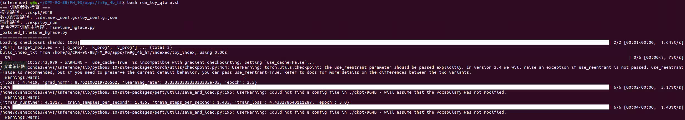

# 2025无人系统具身智能算法挑战赛---九格大模型 4B 量化与训练使用手册


## 介绍

​		本手册旨在指导用户完成九格大模型 4B 版本的量化操作，并基于特定任务指令进行训练。通过量化可减小模型体积、降低内存占用，针对性训练则能提升模型在特定任务上的性能。手册涵盖从环境准备到训练结果查看的完整流程，适合初学者逐步操作。

```
# 2025无人系统具身智能算法挑战赛 使用手册限制条款

© 2025 无人系统具身智能算法挑战赛组委会 版权所有

**使用授权范围：**  
本手册仅授权以下主体在赛事期间使用：

1. 经组委会认证的参赛团队队员
2. 赛事官方裁判及技术监督人员
3. 组委会授权的培训导师

**严格禁止事项：**  

-  任何形式的商业性使用或二次销售  
-  向非参赛组织或个人进行传播  
-  改编后用于其他赛事或商业项目  
-  在线平台/文库的公开传播  

**使用约束：**  
手册所含技术方案、赛事规则及数据参数等知识产权归组委会所有，参赛者仅限：

-  赛事筹备期用于技术方案设计参考
-  正式竞赛期间作为操作规范依据
-  赛后总结阶段用于技术复盘分析

**免责声明：**  
本手册内容按"现有状态"提供：
 组委会不承担因手册信息导致的技术方案偏差责任  
 不保证所含方案满足特定技术场景的实施需求  
 对使用后果不承担直接或间接法律责任  

*违反本条款者组委会有权取消参赛资格并追究法律责任*
```


## 目录

[TOC]


## 1. 模型下载

### 1.1 下载训练代码

通过 Git 克隆训练相关代码库，执行以下命令：

```
git clone https://osredm.com/jiuyuan/CPM-9G-8B.git
```

### 1.2 下载模型文件

访问九格 4B 模型官方下载链接，获取模型压缩包。下载完成后，解压文件并将所有内容放入与本手册同级目录的ckpt文件夹中。

## 2. 环境配置

### 2.1 创建 conda 环境

使用 Python 3.10.16 创建专用 conda 环境，执行以下命令：

```
# 创建环境
conda create -n fm-9g python=3.10.16  
# 激活环境
conda activate fm-9g  
```

### 2.2 安装依赖包

依次安装 PyTorch、训练框架及量化相关工具，命令如下：

```
# 安装基础依赖
pip install torch==2.3.0  
pip install bmtrain  
pip install h5py tensorboardX scipy datamodel_code_generator jsonschema  

# 安装量化与LoRA依赖（使用清华源加速）
pip install -U "transformers==4.43.3" "accelerate==0.33.0" "bitsandbytes==0.46.1" "peft==0.11.1" -i https://pypi.tuna.tsinghua.edu.cn/simple  
pip install bitsandbytes -i https://pypi.tuna.tsinghua.edu.cn/simple  
pip install --upgrade peft -i https://pypi.tuna.tsinghua.edu.cn/simple  
```

## 3. 模型量化

### 3.1 量化原理

量化通过降低模型权重精度（如 4-bit）减少内存占用，本手册采用 QLoRA（量化 LoRA）方法，在保留模型性能的同时实现高效训练。

### 3.2 启用 QLoRA 配置

修改训练脚本[run_huggingface.sh](http://run_huggingface.sh)，启用量化选项并设置参数：

```
# 启用LoRA和QLoRA
use_lora=true  
qlora=true  

# 配置LoRA参数
lora_modules="[\"q_proj\", \"v_proj\", \"k_proj\"]"  # 注入LoRA的注意力层  
lora_r=64  # 低秩维度（通常4~64）  
lora_alpha=32  # 缩放因子  
lora_dropout=0.1  # 防止过拟合  
```

### 3.3 合并 QLoRA 模型

训练完成后，需将 LoRA 适配器权重与原始模型合并，生成可直接推理的模型。使用以下脚本[merge_hugginface_qlora.py](http://merge_hugginface_qlora.py)：

```
import torch  
from peft import PeftModel  
from transformers import AutoModelForCausalLM, AutoTokenizer  

# 路径配置
model_path = "/path/to/your/4b/model"  # 原始模型路径  
adapters_path = "/path/to/your/qlora/weights"  # LoRA权重路径  
output_path = "./merged_model"  # 合并后模型路径  

# 加载模型和分词器
tokenizer = AutoTokenizer.from_pretrained(model_path, trust_remote_code=True)  
model = AutoModelForCausalLM.from_pretrained(  
    model_path,  
    torch_dtype=torch.bfloat16,  
    device_map="auto",  
    trust_remote_code=True  
)  

# 合并权重
model = PeftModel.from_pretrained(model, adapters_path)  
model = model.merge_and_unload()  # 合并并卸载LoRA适配器  

# 保存模型
model.save_pretrained(output_path)  
tokenizer.save_pretrained(output_path)  
```

## 4. 数据处理流程

### 4.1 TXT 转 JSONL 格式

若原始数据为 TXT 文件（每行一条文本），需转换为 JSONL 格式（每行一个 JSON 对象）。创建转换脚本[convert_txt2jsonl.py](http://convert_txt2jsonl.py)：

```
import json  
import sys  

for line in sys.stdin:  
    if line.strip() == "":  
        continue  
    # 格式：input为空（预训练仅计算output的Loss），output为文本内容  
    temp_json = {"input": "", "output": line.strip()}  
    print(json.dumps(temp_json, ensure_ascii=False))  
```

执行转换命令：

```
cat pretrain.txt | python convert_txt2jsonl.py > pretrain.jsonl  
```

示例输入（test.txt）：

```
如何保持良好的睡眠习惯？  
什么是量子计算，它的应用有哪些？  
```

转换后输出（test.jsonl）：

```
{"input": "", "output": "如何保持良好的睡眠习惯？"}  
{"input": "", "output": "什么是量子计算，它的应用有哪些？"}  
```

### 4.2 JSONL 转索引格式

为加速模型加载，需将 JSONL 数据转换为索引格式。使用官方脚本[convert_json2index.py](http://convert_json2index.py)：

```
# 创建数据文件夹  
mkdir -p jsonl_data indexed_data  
mv test.jsonl jsonl_data/  # 放入JSONL文件  

# 执行转换  
python convert_json2index.py \  
  --path ./jsonl_data/test.jsonl \  # JSONL文件路径  
  --language zh \  # 中文数据填zh，英文填en  
  --output ./indexed_data/test_index  # 索引输出路径  
```

转换后indexed_data/test_index文件夹生成 4 个文件：

- data.jsonl：原始数据备份

- index、index.h5：索引文件

- meta.json：数据统计信息（行数、token 数等）

### 4.3 创建数据配置文件

在dataset_configs文件夹下创建toy_config.json，指定数据集路径及参数：

```
[
  {
    "dataset_name": "toy_demo",  
    "task_name": "toy_demo",  
    "abs_weight": 1.0,  # 数据混合权重（单数据集设为1.0）  
    "path": "./indexed_data/test_index",  # 索引数据路径  
    "transforms": null,  # 无需数据转换设为null  
    "allow_repeat": true,  # 小数据集允许重复  
    "nlines": 3,  # 数据行数（与meta.json一致）  
    "ave_tokens_per_line": 15,  # 平均token数（参考meta.json）  
    "total_tokens": 0.000001  # 总token数（单位：十亿）  
  }
]
```

## 5. 任务特定微调

### 5.1 核心参数配置

在训练脚本中设置任务相关参数，重点配置如下：

```
train_data_config_path="./dataset_configs/toy_config.json"  # 数据配置文件路径  
batch_size=1  # 单卡batch大小（量化模型建议1~2）  
lr=2e-4  # 学习率（QLoRA常用1e-4~3e-4）  
model_max_length=2048  # 最大序列长度  
num_train_epochs=3  # 训练轮次（小数据集建议3~5轮）  
```

### 5.2 单机训练启动

确保已激活环境并指定 GPU，执行训练脚本：

```
# 激活环境  
conda activate fm-9g  

# 指定GPU（单卡用0，多卡用0,1,...）  
export CUDA_VISIBLE_DEVICES=0  

# 运行训练脚本  
bash run_toy_qlora.sh  
```



## 6. 训练脚本说明

### 6.1 脚本内容

修改`finetune_hgface.py`

```
# -*- coding: utf-8 -*-
"""
finetune_hgface.py —— 单机 / 多机 LoRA / QLoRA 微调九格 4B
"""

import os, sys, json, logging, importlib.util
from dataclasses import dataclass, field
from typing import Dict, List, Optional

import numpy as np
import torch
from torch.utils.data import Dataset
from transformers import (
    AutoModelForCausalLM,
    AutoTokenizer,
    BitsAndBytesConfig,
    HfArgumentParser,
    PreTrainedTokenizer,
    Trainer,
    TrainingArguments as HFTrainingArguments,
)

logging.basicConfig(
    level=logging.INFO, format="%(asctime)s - %(levelname)s - %(message)s"
)
logger = logging.getLogger(__name__)

# ---------- 九格 indexed dataset ---------- #
sys.path.append("../../")
from fm9g.dataset.indexed_dataset import IndexedDataset  # noqa: E402

@dataclass
class ModelArguments:
    model_name_or_path: str = field(
        default="./ckpt/9G4B",
        metadata={"help": "本地 HF 权重文件夹或 HuggingFace Hub repo_id"},
    )


@dataclass
class DataArguments:
    train_data_path: Optional[str] = field(
        default=None, metadata={"help": "单数据集索引目录"}
    )
    train_data_config_path: Optional[str] = field(
        default=None, metadata={"help": "多数据集混合配置 json"}
    )
    eval_data_path: Optional[str] = field(
        default=None, metadata={"help": "验证集索引目录"}
    )


@dataclass
class TrainingArguments(HFTrainingArguments):
    model_max_length: int = field(default=4096)
    use_lora: bool = field(default=False)
    qlora: bool = field(default=False)
    lora_modules: str = field(
        default='["project_q","project_k","project_v","w_0","w_1","w_out"]'
    )
    lora_r: int = field(default=16)
    lora_alpha: int = field(default=32)
    lora_dropout: float = field(default=0.05)


def _load_transform_func(cfg: Dict, cfg_path: str):
    tf_path = os.path.join(os.path.dirname(cfg_path), cfg["transforms"])
    if not os.path.exists(tf_path):
        raise FileNotFoundError(tf_path)
    mod_name = os.path.splitext(os.path.basename(tf_path))[0]
    spec = importlib.util.spec_from_file_location(mod_name, tf_path)
    module = importlib.util.module_from_spec(spec)
    spec.loader.exec_module(module)  # type: ignore
    if not hasattr(module, "transform"):
        raise AttributeError(f"{tf_path} 缺少 transform 函数")
    return module.transform


class SupervisedDataset(IndexedDataset):
    def __init__(self, path: str, tok: PreTrainedTokenizer, tf=None):
        super().__init__(path=path)
        self.tok, self.tf = tok, tf

    def __getitem__(self, idx):
        sample = json.loads(super().__getitem__(idx).decode())
        if self.tf:
            sample = self.tf(sample, 0, 0)
        user, ans = sample.get("input", ""), sample["output"]
        if user:
            user = self.tok.apply_chat_template(
                [{"role": "user", "content": user}],
                tokenize=False,
                add_generation_prompt=True,
            )
        return {
            "input_ids": user,
            "labels": ans + self.tok.eos_token,
        }


class MixedDataset(Dataset):
    def __init__(self, datasets: List[Dataset], probs: List[float]):
        lens = np.array([len(d) for d in datasets])
        probs = np.array(probs) / sum(probs)
        reps = np.round(probs / probs.min()).astype(int)
        self.cycle = reps.sum()
        self.total_len = int((lens / reps).min()) * self.cycle
        self.ds_sched = np.repeat(np.arange(len(datasets)), reps)
        self.id_sched = np.concatenate([np.arange(r) for r in reps])
        self.reps, self.datasets = reps, datasets

    def __len__(self):
        return self.total_len

    def __getitem__(self, idx):
        cyc, pos = divmod(idx, self.cycle)
        ds_id = int(self.ds_sched[pos])
        ins_id = int(self.reps[ds_id] * cyc + self.id_sched[pos])
        return self.datasets[ds_id][ins_id]


class Collector:
    def __init__(self, tok: PreTrainedTokenizer, ignore_idx=-100, max_len=4096):
        self.tok, self.ignore, self.max = tok, ignore_idx, max_len

    def __call__(self, batch):
        # batch: [{"input_ids": str_or_empty, "labels": str}, ...]
        if batch[0]["input_ids"]:
            users = [b["input_ids"] for b in batch]
            full = [b["input_ids"] + b["labels"] for b in batch]

            enc_f = self.tok(
                full,
                padding=True,
                truncation=True,
                max_length=self.max,
                return_tensors="pt",
            )
            enc_u = self.tok(
                users,
                padding=True,
                truncation=True,
                max_length=self.max,
                return_tensors="pt",
            )
            ulen = enc_u.attention_mask.sum(1)

            labels = enc_f.input_ids.clone()
            # 忽略 user 部分
            for i, ul in enumerate(ulen):
                labels[i, : ul] = self.ignore
            # 忽略 PAD 位置
            labels[enc_f.input_ids == self.tok.pad_token_id] = self.ignore
        else:
            full = [b["labels"] for b in batch]
            enc_f = self.tok(
                full,
                padding=True,
                truncation=True,
                max_length=self.max,
                return_tensors="pt",
            )
            labels = enc_f.input_ids.clone()
            # 忽略 PAD 位置
            labels[enc_f.input_ids == self.tok.pad_token_id] = self.ignore

        return {
            "input_ids": enc_f.input_ids,
            "attention_mask": enc_f.attention_mask,
            "labels": labels,
        }
def load_model_and_tokenizer(model_path, **kw):
    import torch
    from transformers import AutoModelForCausalLM, AutoTokenizer, BitsAndBytesConfig
    from peft import prepare_model_for_kbit_training, get_peft_model, LoraConfig
    import bitsandbytes as bnb
    import torch.nn as nn

    # ---- 读取训练开关/超参 ----
    use_lora: bool = bool(kw.get("use_lora", False) or kw.get("qlora", False))
    qlora: bool = bool(kw.get("qlora", False))
    lora_r: int = int(kw.get("lora_r", 16))
    lora_alpha: int = int(kw.get("lora_alpha", 32))
    lora_dropout: float = float(kw.get("lora_dropout", 0.05))
    # run_toy_qlora.sh 里会传进来解析后的列表
    lora_modules = kw.get("lora_modules", None)
    # dtype 仅用于非QLoRA（全精度/半精度 LoRA）
    dtype = kw.get("dtype", torch.bfloat16)

    # ---- Tokenizer ----
    tokenizer = AutoTokenizer.from_pretrained(
        model_path, use_fast=True, trust_remote_code=True
    )
    # 补齐 PAD，防止 DataCollator/Trainer 要求 padding 报错
    if tokenizer.pad_token is None:
        tokenizer.pad_token = tokenizer.eos_token
        tokenizer.pad_token_id = tokenizer.eos_token_id
    tokenizer.padding_side = "right"   # Causal LM 的常用设置

    # ---- 加载基座模型 ----
    if qlora:
        # QLoRA：4bit 量化加载
        bnb_cfg = BitsAndBytesConfig(
            load_in_4bit=True,
            bnb_4bit_quant_type="nf4",
            bnb_4bit_use_double_quant=True,
            bnb_4bit_compute_dtype=torch.bfloat16,   # 老卡可用 torch.float16
        )
        model = AutoModelForCausalLM.from_pretrained(
            model_path,
            trust_remote_code=True,
            quantization_config=bnb_cfg,
            device_map=None,            # 避免 accelerate.dispatch_model
            low_cpu_mem_usage=True,
            torch_dtype=torch.bfloat16
        )
    else:
        # 普通 LoRA（不量化基座）
        model = AutoModelForCausalLM.from_pretrained(
            model_path,
            trust_remote_code=True,
            device_map=None,
            low_cpu_mem_usage=True,
            torch_dtype=dtype
        )

    # 保证模型配置使用同一 pad_token_id
    model.config.pad_token_id = tokenizer.pad_token_id

    # ---- 不用 LoRA 直接返回 ----
    if not use_lora:
        return model, tokenizer

    # ---- QLoRA 需要做 k-bit 训练预处理 ----
    if qlora:
        model = prepare_model_for_kbit_training(model)

    # ---- 自动推断 target_modules，确保命中叶子层 ----
    if qlora:
        leaf_names = [n for n, m in model.named_modules() if isinstance(m, bnb.nn.Linear4bit)]
        assert len(leaf_names) > 0, "未检测到 bnb Linear4bit 层，请确认模型是否按 4bit 加载"
    else:
        leaf_names = [n for n, m in model.named_modules() if isinstance(m, nn.Linear)]

    inferred_suffixes = sorted({n.split(".")[-1] for n in leaf_names})
    inferred_suffixes = [s for s in inferred_suffixes if s not in ("lm_head", "embed_out")]

    # 若用户提供 lora_modules（如 ["project_q","project_k",...]），与推断结果求交集；为空则用推断
    if isinstance(lora_modules, list) and len(lora_modules) > 0:
        target_modules = [s for s in lora_modules if s in inferred_suffixes]
        if not target_modules:
            target_modules = inferred_suffixes
    else:
        target_modules = inferred_suffixes

    print(f"[PEFT] target_modules -> {target_modules[:20]} ... (total {len(target_modules)})")

    # ---- 构造 LoRA 配置并注入 ----
    lconf = LoraConfig(
        r=lora_r,
        lora_alpha=lora_alpha,
        lora_dropout=lora_dropout,
        bias="none",
        task_type="CAUSAL_LM",
        target_modules=target_modules,
        modules_to_save=["lm_head"],   # 训练/保存时常用
    )
    model = get_peft_model(model, lconf)

    return model, tokenizer

if __name__ == "__main__":
    parser = HfArgumentParser((ModelArguments, DataArguments, TrainingArguments))
    m_args, d_args, t_args = parser.parse_args_into_dataclasses()

    # 检查 lora_modules 参数格式
    try:
        lora_modules_list = json.loads(t_args.lora_modules)
    except json.JSONDecodeError:
        logger.error(f"lora_modules 参数不是一个有效的JSON字符串: {t_args.lora_modules}")
        # 九格官方文档中 target_modules 格式为 "w_0,w_1,..."，这里做一个兼容
        lora_modules_list = t_args.lora_modules.split(',')
        logger.warning(f"已尝试按逗号分割, 得到: {lora_modules_list}")

    model, tokenizer = load_model_and_tokenizer(
        model_path=m_args.model_name_or_path,
        dtype=torch.bfloat16
        if t_args.bf16
        else torch.float16
        if t_args.fp16
        else torch.float32,
        use_lora=t_args.use_lora,
        qlora=t_args.qlora,
        lora_modules=lora_modules_list,
        lora_r=t_args.lora_r,
        lora_alpha=t_args.lora_alpha,
        lora_dropout=t_args.lora_dropout,
    )
    if getattr(t_args, "gradient_checkpointing", False):
        # 关闭 use_cache（避免与 checkpoint 冲突）
        if hasattr(model, "config"):
            model.config.use_cache = False

        try:
            model.gradient_checkpointing_disable()
        except Exception:
            pass

        try:
            model.gradient_checkpointing_enable(
                gradient_checkpointing_kwargs={"use_reentrant": False}
            )
        except TypeError:
            model.gradient_checkpointing_enable()
            logger.warning(
                "[GC] 当前 Transformers 不支持 gradient_checkpointing_kwargs；"
                "若仍发生 'marked as ready twice'，请临时关闭 --gradient_checkpointing。"
            )


        if hasattr(model, "enable_input_require_grads"):
            try:
                model.enable_input_require_grads()
            except Exception:
                pass

    if hasattr(t_args, "ddp_find_unused_parameters"):
        t_args.ddp_find_unused_parameters = False

    if d_args.train_data_config_path:
        cfgs = json.load(open(d_args.train_data_config_path))
        sub_ds, probs = [], []
        for cfg in cfgs:
            tf = _load_transform_func(cfg, d_args.train_data_config_path)
            sub_ds.append(SupervisedDataset(cfg["path"], tokenizer, tf))
            probs.append(cfg["abs_weight"])
        probs = [p / sum(probs) for p in probs]
        train_set = MixedDataset(sub_ds, probs)
    elif d_args.train_data_path:
        train_set = SupervisedDataset(d_args.train_data_path, tokenizer)
    else:
        raise ValueError("必须提供 train_data_path 或 train_data_config_path")

    eval_set = (
        SupervisedDataset(d_args.eval_data_path, tokenizer)
        if d_args.eval_data_path
        else None
    )
    if eval_set is None:
        t_args.evaluation_strategy = "no"

    collector = Collector(tokenizer, max_len=t_args.model_max_length)
    trainer = Trainer(
        model=model,
        args=t_args,
        train_dataset=train_set,
        eval_dataset=eval_set,
        tokenizer=tokenizer,
        data_collator=collector,
    )
    trainer.train()
    trainer.save_model(t_args.output_dir)

```

训练脚本[run_toy_qlora.sh](http://run_toy_qlora.sh)完整配置如下，可根据需求调整参数：

```
#!/usr/bin/env bash  
# 单GPU QLoRA微调脚本（九格4B量化模型）  
export TOKENIZERS_PARALLELISM=true  
export CUDA_VISIBLE_DEVICES=0  # 指定GPU  

# 路径配置  
train_data_config_path="./dataset_configs/toy_config.json"  
eval_data_path=""  
model_name_or_path="./ckpt/9G4B"  

# 训练超参  
batch_size=1  
model_max_length=2048  
lr=2e-4  
num_train_epochs=3  

# QLoRA配置  
use_lora=true  
qlora=true  
lora_modules="[\"q_proj\",\"k_proj\",\"v_proj\"]"  
lora_r=32  
lora_alpha=64  
lora_dropout=0.05  

# 输出路径  
exp_dir="./exp"  
identity=toy_run  

# 启动训练  
torchrun \  
  --nproc_per_node 1 \  
  --master_addr 127.0.0.1 \  
  --master_port 6006 \  
  -m finetune_hgface \  
  --model_name_or_path "$model_name_or_path" \  
  --train_data_config_path "$train_data_config_path" \  
  --use_lora "$use_lora" \  
  --qlora "$qlora" \  
  --lora_modules "$lora_modules" \  
  --output_dir "$exp_dir/$identity" \  
  --num_train_epochs "$num_train_epochs" \  
  --per_device_train_batch_size "$batch_size"  
```

### 6.2 脚本参数说明

| 参数          | 作用                        | 建议值范围          |
| ------------- | --------------------------- | ------------------- |
| lora_r        | LoRA 低秩维度，控制模型容量 | 4~64                |
| lora_alpha    | 缩放因子，影响参数更新幅度  | 通常为lora_r的 2 倍 |
| lora_dropout  | 防止过拟合的 dropout 率     | 0~0.1               |
| batch_size    | 单卡批次大小                | 1~2（量化模型）     |
| learning_rate | 学习率                      | 1e-4~3e-4           |

## 7. 查看训练情况

使用 TensorBoard 可视化训练过程中的损失、学习率等指标，执行以下命令：

```
# 日志路径为训练脚本中--output_dir指定的路径  
tensorboard --logdir ./exp/toy_run  
```
