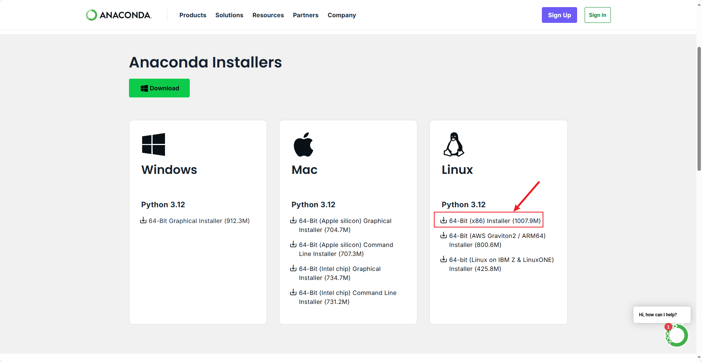
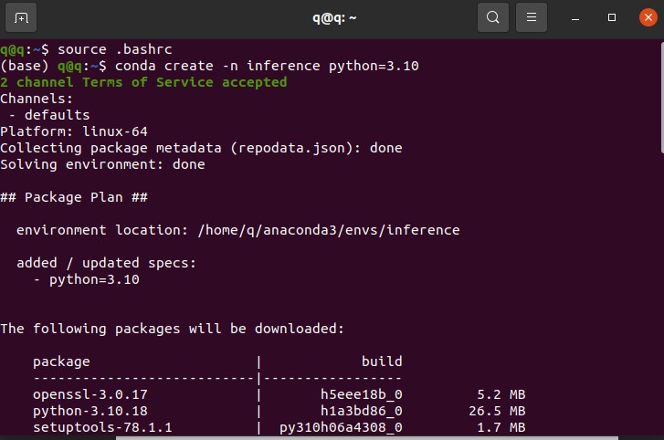
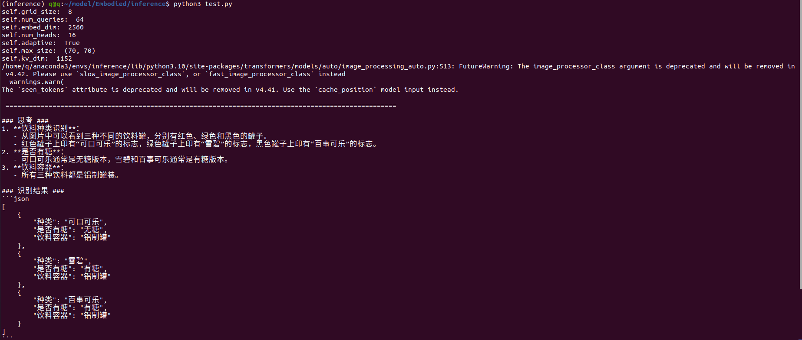

# 2025无人系统具身智能算法挑战赛---机械臂场景应用挑战赛使用手册


## 介绍

​		本手册专为" 2025无人系统具身智能算法挑战赛 "中的机械臂场景应用挑战赛参赛队伍设计，提供完整的大模型-机械臂协同开发指导手册。手册围绕"视觉感知-决策控制-机械臂执行"的技术闭环，帮助参赛者快速构建基于九格大模型的机械臂控制系统。

​		本手册采用"理论→工具→实践"的递进式设计，助力参赛团队快速实现"语言指令→场景理解→动作执行"的智能机械臂控制闭环，为大赛竞技提供了坚实的技术支撑。

```
# 2025无人系统具身智能算法挑战赛 使用手册限制条款

© 2025 无人系统具身智能算法挑战赛组委会 版权所有

**使用授权范围：**  
本手册仅授权以下主体在赛事期间使用：
1. 经组委会认证的参赛团队队员
2. 赛事官方裁判及技术监督人员
3. 组委会授权的培训导师

**严格禁止事项：**  
-  任何形式的商业性使用或二次销售  
-  向非参赛组织或个人进行传播  
-  改编后用于其他赛事或商业项目  
-  在线平台/文库的公开传播  

**使用约束：**  
手册所含技术方案、赛事规则及数据参数等知识产权归组委会所有，参赛者仅限：
-  赛事筹备期用于技术方案设计参考
-  正式竞赛期间作为操作规范依据
-  赛后总结阶段用于技术复盘分析

**免责声明：**  
本手册内容按"现有状态"提供：
 组委会不承担因手册信息导致的技术方案偏差责任  
 不保证所含方案满足特定技术场景的实施需求  
 对使用后果不承担直接或间接法律责任  

*违反本条款者组委会有权取消参赛资格并追究法律责任*
```


## 目录

[TOC]

------


## （一）环境配置

​		**本次大赛推荐使用的操作系统为ubuntu20.04、显卡显存22G及以上**

#### 1.ROS安装

##### 1.1 安装

​		**官网安装**：https://www.ros.org/blog/getting-started/

​		同时支持一键安装，极大提升安全效率与便捷性

​		**一键安装**：打开终端，输入下面命令，进行一键安装，推荐使用ROS Noetic版本

```
wget http://fishros.com/install -O fishros && . Fishros
```

##### 1.2 测试ROS

**需求：**判断是否能使用键盘控制小乌龟移动

**操作：**

​		开启终端一：

```
#启动roscore核心
roscore
```

​		开启终端二：

```
#出现图形化界面
rosrun turtlesim turtlesim_node
```

​		开启终端三：

```
#启动键盘控制节点
rosrun turtlesim turtle_teleop_key
```

​		**注意：**光标必须聚焦在键盘控制窗口，否则不能控制乌龟运动

##### 1.3 安装依赖

```
sudo apt install nlohmann-json3-dev
```

#### 2.Anaconda安装

##### 2.1 官网下载

​		通过官网下载安装包，官网地址：[Download Now | Anaconda](https://www.anaconda.com/download/success)

​		具体版本根据自己的电脑环境进行选择



##### 2.2 安装

​		找到安装包的位置，点击右键选择在终端中打开，输入 

```
sh 安装包名
```

​		回车出现 `Please answer yes or no` 选项后，输入 yes

​		回车出现 `You can undo this by running ‘ conda init --reverse $SHELL ’ ? [yes|no]` 选项后，输入no

##### 2.3 环境配置

​		进入主目录，通过 Ctrl+H 命令显示隐藏文件，找到 .bashrc 文件，打开后在最后一行添加

```
source ~/anaconda3/bin/activate
```

##### 2.4 验证环境

​		关掉前面的终端，开一个新的终端，当 (base) 出现在命令提示符前面说明成功安装了环境。

#### 3.九格大模型环境配置

##### 3.1 创建虚拟环境inference

​		先启动anaconda环境，输入下面命令，创建虚拟环境 inference（环境名可自定义）

```
conda create -n inference python=3.10 
```



​		回车出现 `Proceed ([y] / n)` 选项后，输入 y

​		完成进程后，输入下面命令进入之前创建的虚拟环境

```
conda activate inference
```

​		当 (inference) 出现在命令提示符前面说明成功创建了虚拟环境。

**3.2 下载大模型**

​		官网下载：可在 https://thunlp-model.oss-cn-wulanchabu.aliyuncs.com/9G4B.tar 下载4B模型。

​		百度网盘：https://pan.baidu.com/s/1o8GMcEl_SYc2euaifVKstQ?pwd=8888       提取码: 8888 

​		阿里云网盘：https://www.alipan.com/s/be42mHqfrWX       提取码: 1zp2

##### 3.2 环境配置

​		找到模型文件所在目录   /model/Embodied/ 点击右键选择在终端打开，输入下面命令

```
#先进入上面创建的虚拟环境
conda activate inference
#下载
pip install -r requirements.txt
#如果下载比较慢，添加清华源
pip install -r requirements.txt -i https://pypi.tuna.tsinghua.edu.cn/simple
```

##### 3.3 测试模型

​		进入 /model/Embodied/inference/test.py，修改model_file路径为选手自己电脑路径（图中24行）


​		进入 /model/Embodied/inference 运行下面代码

```
python3 test.py
```



#### 4.yolov8安装

##### 4.1 安装yolov8

​		打开终端

```
#创造 yolov8 虚拟环境
conda create -n yolov8 python=3.8
#下载nvidia-cuda-toolkit
sudo apt install nvidia-cuda-toolkit
#查看conda版本
nvidia-smi
#安装pytorch，到官网寻找相关的版本
https://pytorch.org/   选择对应版本
#进入yolov8虚拟环境
conda activate yolov8
#选择对应pytorch版本的对应命令进行下载
#下载YOLOv8官方代码库
git clone https://github.com/ultralytics/ultralytics.git
#安装YOLOv8所有依赖
pip install -r requirements.txt
```


------

#### 5.Isaac Sim安装

##### 5.1 官网下载

​		Isaac Sim官方网站：https://docs.isaacsim.omniverse.nvidia.com/4.5.0/installation/download.html


​		选择Isaac Sim 4.5.0版本，点击Linux下载后，将下载好的压缩包进行解压，解压后的文件放在/home的主目录下。

##### 5.2 环境配置

```
# 编辑 ~/.bashrc 文件的命令
sudo gedit ~/.bashrc
# 在文件末尾添加以下内容（替换 /home/your_username/isaacsim/python.sh 为您的实际路径）
export ISAACSIM_PATH="${HOME}/isaacsim"
export ISAACSIM_PYTHON_EXE="/home/your_username/isaacsim/python.sh"
```

​		按 Ctrl+S  保存

```
# 刷新环境
source .bashrc
```

## （二）仿真部分

#### 1.下载仿真代码

##### 1.1 下载仿真代码

```
仿真代码与本手册位于同一目录下
```

​		将jaka和EAICON源代码拷贝复制到/home/your_username下

##### 1.2 编译

```
#终端进入jaka工作空间（仅需要编译jaka）
catkin build
```

##### 1.3 修改编译文件

​		找到`jaka/devel/lib/large_scale_model_arm/isaac_yolov8.py`，修改第一行的环境路径为

```
#!/usr/bin/env python
```

```
#添加到bashrc文件后面
export LD_PRELOAD=/usr/lib/x86_64-linux-gnu/libffi.so.7
```

​		找到`jaka/devel/lib/large_scale_model_arm/isaac_scale.py`，修改第一行的环境路径为

```
#!/usr/bin/env python
```

​		在终端中输入以下命令

```
# 刷新环境
source .bashrc
```

#### 2.运行机械臂仿真

**需求：**获取右上角瓶子的坐标，并将瓶子放到左侧传送带上

**操作：**

​		开启终端一：

```
#启动roscore核心
roscore
```

​		开启终端二：

```
#进入工作空间
cd EAICON
#启动仿真环境
sh run_jaka_sim.sh
```

​		开启终端三：

```
#进入工作空间
cd jaka
#激活 yolov8 环境
conda activate yolov8
pip3 install rospkg catkin_pkg
#运行 Python文件
rosrun large_scale_model_arm isaac_yolov8.py
```

​		开启终端四：

```
#进入工作空间
cd jaka
#激活 inference 环境
conda activate inference
pip3 install rospkg catkin_pkg
pip uninstall -y numpy
pip install "numpy==1.24.4" --no-cache-dir -i https://pypi.tuna.tsinghua.edu.cn/simple
pip install opencv-python-headless
#运行 Python文件
rosrun large_scale_model_arm isaac_scale.py
```

​		开启终端五：

```
#进入工作空间
cd jaka
#退出当前环境，返回默认环境
conda deactivate
#运行 launch文件
roslaunch large_scale_model_arm isaac_jaka.launch
```

​		**注意：**每次操作前都需要输入 `source ./devel/setup.bash` 刷新环境，否则有概率出现莫名其妙的报错。

------

## （三）大模型接口

​		该版本通用大模型参数量为40亿，具有高效训练与推理和高效适配与部署的技术特点，具备文本问答、文本分类、机器翻译、文本摘要等自然语言处理能力。九格百亿级通用基础大模型的参数量为4B（40亿）。可在 https://thunlp-model.oss-cn-wulanchabu.aliyuncs.com/9G4B.tar 里下载。

​		本表聚焦“九格”接口设计中与大模型相关的部分，将其抽象为模型加载、推理调用两大核心单元，具体接口列表如下：

|   接口名称   |                      描述                       |                          调用方式                           |                           输入参数                           |                           输出                            |                      异常处理                       |
| :----------: | :---------------------------------------------: | :---------------------------------------------------------: | :----------------------------------------------------------: | :-------------------------------------------------------: | :-------------------------------------------------: |
| 模型加载接口 |    从本地或远程路径加载大模型及其 Tokenizer     | `AutoModel.from_pretrained` `AutoTokenizer.from_pretrained` | - `model_file` (字符串)：权重与配置存放路径 - `trust_remote_code` (布尔)：是否信任远程自定义代码 | - `self.model` (模型对象) - `self.tokenizer` (分词器对象) | 捕获并 `rospy.logerr`，加载失败时置空并退出订阅流程 |
| 推理调用接口 | 根据输入图像与文本 Prompt，调用模型生成推理结果 |  `model.chat(image=None, msgs, tokenizer=self.tokenizer)`   |                 - `msgs` (列表)：每项为字典                  |                                                           |                                                     |


#### 1.模型加载接口

```python
  self.model = AutoModel.from_pretrained(
      model_file: str,
      trust_remote_code: bool = True,
      attn_implementation: str = 'sdpa',
      torch_dtype: torch.dtype = torch.bfloat16
  )
  self.tokenizer = AutoTokenizer.from_pretrained(
      model_file: str,
      trust_remote_code: bool = True
  )
```

**参数说明**

​		**model_file**：本地或远程路径，预训练模型权重与配置所在目录。

​		**trust_remote_code**：是否信任并执行仓库中的自定义代码。

​		**attn_implementation** 与 **torch_dtype**：可选优化参数。

**输出说明**

​		**self.model**：已加载并 eval() 的模型实例，已切换到 CUDA（若可用）。

​		**self.tokenizer**：对应的分词器，用于构造输入tokens。

**异常处理**

​		捕获任何加载错误，调用 **rospy.logerr**("模型加载失败: %s", e) 并将**self.model/self.tokenizer** 置为 None，后续流程根据空值判断跳过订阅与推理。

#### 2.推理调用接口

```
model_res = self.model.chat(
    image=None,
    msgs: List[Dict[str, Any]],
    tokenizer=self.tokenizer
)
```

**输入说明**

​		**msgs**：长度可变的消息列表，每条消息格式为：

```
{
  'role': 'user',
  'content': [pil_image: PIL.Image.Image, prompt: str]
}
```

​		**pil_image**：从最新 ROS 彩色帧转换而来。

​		**prompt**：用户或上层脚本动态输入的文本提示。

**输出说明**

​		**model_res**：大模型返回的推理结果，可为文本、结构化数据或二次封装，随后转换为字符串发布。

**调用时机**

​		在 self.new_bbox_request == True 且最新图像帧已获取时触发。

**异常处理**

​		推理过程中捕获任何异常并调用 rospy.logerr("调用大模型进行处理时出错: %s", e)，当前帧推理终止，不影响后续请求。

------

## （四）机械臂接口

#### 1.运动控制接口

​		本表列出了本次仿真中机械臂及夹爪的 ROS 话题接口。

| 话题名称                      | 消息类型                    | 发布/订阅 | 功能说明                                                     |
| ----------------------------- | --------------------------- | --------- | ------------------------------------------------------------ |
| `/Jaka/get_end_effector_pose` | `geometry_msgs/PoseStamped` | 发布      | 获取末端执行器（机械臂手腕）在基座坐标系下的位置和姿态       |
| `/Jaka/set_end_effector_pose` | `geometry_msgs/PoseStamped` | 订阅      | 设置末端执行器目标位置和姿态                                 |
| `/Jaka/get_gripper_value`     | `std_msgs/Float64`          | 发布      | 获取当前夹爪开合关节的数值（单位：米，范围 0 – 0.04）        |
| `/Jaka/set_gripper_value`     | `std_msgs/Float64`          | 订阅      | 发送夹爪目标开合数值（单位：米，范围 0 – 0.04）              |
| `/Jaka/get_jointstate`        | `sensor_msgs/JointState`    | 发布      | 获取机器人各关节的当前位置、速度和力矩                       |
| `/Jaka/tf`                    | `tf`                        | 发布      | 发布机器人各坐标系之间的变换                                 |
| `/Jaka/gripper_is_captured`   | `std_msgs/Bool`             | 发布      | 夹爪是否已经抓取到物体，`True` 表示成功抓取，`False` 表示尚未抓取 |

##### 1.1夹爪控制逻辑---增量闭合策略

- 从 `/Jaka/get_gripper_value` 读取当前夹爪开合数值 `g`。

- 在循环中，以固定步长 Δ=0.001 m 递增发送：

  ```
  new_g = g + 0.001
  publish("/Jaka/set_gripper_value", new_g)
  ```

- 每次发送后，订阅 `/Jaka/gripper_is_captured` 话题：

  若返回 `False`，继续增量闭合；

  若返回 `True`，表示夹爪已成功夹住物品，停止发送增量命令。

#### 2.相机接口

本表列出了仿真中相机相关的 ROS 话题接口，用于获取深度图、相机参数以及 RGB 图像。

| 话题名称             | 消息类型                 | 发布/订阅 | 功能说明                                                     |
| -------------------- | ------------------------ | --------- | ------------------------------------------------------------ |
| `/Jaka/camera_depth` | `sensor_msgs/Image`      | 发布      | 深度相机图像，像素值为深度（单位：米），用于场景深度感知。   |
| `/Jaka/camera_info`  | `sensor_msgs/CameraInfo` | 发布      | 相机内参（焦距、光心、畸变系数等），供图像去畸变与三维重建使用。 |
| `/Jaka/camera_rgb`   | `sensor_msgs/Image`      | 发布      | RGB 彩色图像（编码：`rgb8`），用于视觉检测、语义分割或显示画面。 |

**深度图像 (`/Jaka/camera_depth`)**

- 常见编码：`32FC1` 或 `16UC1`
- 可直接用于点云生成或距离测量。

**相机信息 (`/Jaka/camera_info`)**

- 包含 `K`（3×3 内参矩阵）、`D`（畸变系数）、`R`（旋转矩阵）、`P`（投影矩阵）等字段。
- 与图像话题配对使用，确保去畸变与精确投影。

**彩色图像 (`/Jaka/camera_rgb`)**

- 编码 `rgb8`，分辨率与帧率与深度图保持一致。
- 可用于目标检测、语义分割、大模型推理等上层算法输入。

#### 3.规划控制接口

| 类 / 位置                                 | 函数                                                         | 说明                                            | 调用时机     |
| ----------------------------------------- | ------------------------------------------------------------ | ----------------------------------------------- | ------------ |
| **JakaRmpFlowController** (`jaka_env.py`) | `plan_and_execute_trajectory(target_pos, target_rot_wxyz, duration=5.0)` | 末端 IK → **TRRT*** → 样条 → 保存轨迹           | 收到新目标时 |
|                                           | `update_trajectory_tracking(gripper_value)`                  | 依据 `self.trajectory` 做线性插值并下发关节位置 | 每帧         |
|                                           | `forward_and_track(gripper_value=None)`                      | 包装：跟踪 + 夹爪状态机                         | 每帧         |
|                                           | `get_end_effector_pose()`                                    | 正向解算，返回 `(pos, quat_wxyz)`               | 多处         |
|                                           | `reset()`                                                    | 初始化关节/夹爪                                 | world.reset  |
| **SimEnvironment** (`jaka_sim.py`)        | `step()`                                                     | 检测新目标 → 调规划 → 调跟踪 → 发布 ROS 数据    | 每帧         |
|                                           | `publish_ros_data()`                                         | 发 `/pose` `/joint_states` `/gripper_efforts`   | 每帧         |

